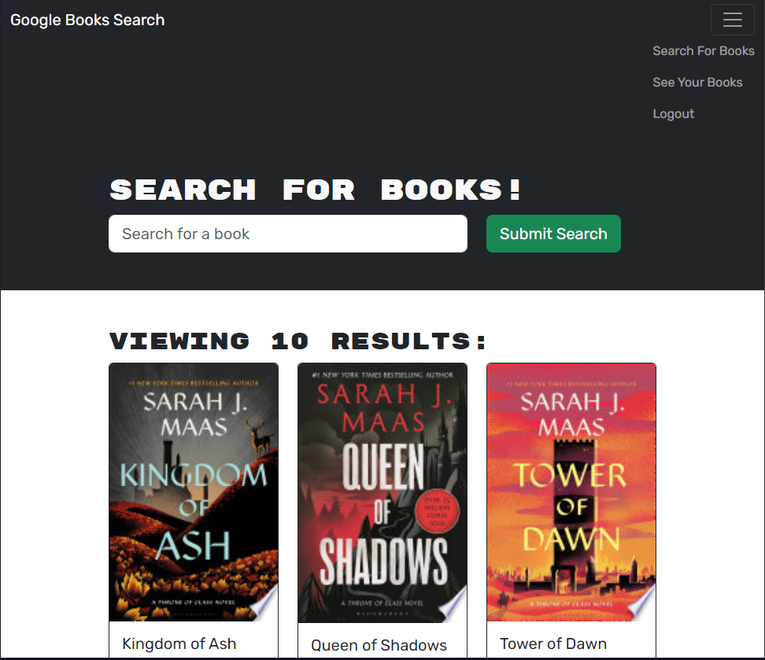

# Title: Google Books Search Engine 

## Table of Contents
- [Description](#description)
- [Technology](#technology)
- [Usage](#installation/usage)
- [Contribution](#contribution)
- [Questions](#questions)

## Description
In this project, I was tasked with taking a Google Books API search engine built with a RESTful API and refactoring it to be a GraphQL API built with Apollo Server. The app was built using the MERN stack, with a React front end, MongoDB database, and Node.js/Express.js server and API. This application allows users to signup/login, search for books in the Google Books API library, and save or delete books on their saved book list. 

### Deployed Application on Render:

### Screenshot of Application

### Technology
- Node.js
- React/Vite
- MongoDB 
- GraphQL and Apollo Server

## Usage
- Clone the repository and enter `npm run render-build` in the command line to build the application and install all dependencies
- Enter `npm run develop` in the command-line to start the application server on your localhost

## Contribution
- Fork the repository

## Questions
Contact me with questions: 
- https://github.com/ccarroll929 
- ccarroll0528@gmail.com
